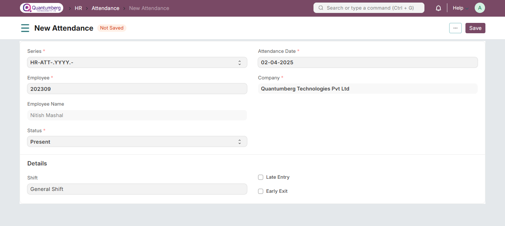

# Attendance

**Attendance is a record indicating whether an Employee was present on a particular day.**

In QuantumBerg HRMS, you can mark and record attendance on a daily basis using the Attendance module.

To access Attendance, go to:

    Home > Human Resources > Attendance

**1. Prerequisites**

Before creating an Attendance record, ensure that you have the following:

* [Employee](../Organization%20Management/Employee.md)

* [Shift Type](../shifttype.md)

**2. How to Create an Attendance Record**

1. Go to the Attendance list, Click on New.

2. Select the Employee.

3. Select the Attendance Date.

4. Choose the Shift (optional).

5. Select the Status (Present, Absent, On Leave, Half Day).

6. Save and Submit.

    Note: Attendance cannot be marked for future dates.

You can view a monthly report of Attendance data in the **Monthly Attendance Details** report.

The Employee Attendance Tool allows you to set attendance for multiple employees easily.

You can also bulk upload attendance using the Upload Attendance feature.

**3. Features**

**3.1 Marking Unmarked Attendance**

If attendance for some employees is not marked, you can update their status as Present, Absent, or Half Day.

**How to Mark Attendance**

1. Go to the Attendance list.

2. Click on the **Mark Attendance** button.

3. A dialog box will appear.

4. Select the Employee and Month.

5. Choose the Status (Present, Absent, or Half Day).

6. To exclude holidays, check Exclude Holidays.

7. Select the dates for marking attendance for the chosen Employee.

8. Click **Mark Attendance** and confirm by clicking **Yes**.

**4. Related Topics**

1. Employee Attendance Tool

2. Shift Management

3. Auto Attendance

4. Upload Attendance

5. Attendance Request

You can also automate attendance marking based on check-in/check-out logs from Biometric, RFID Devices, or similar mechanisms that generate IN/OUT logs.

For more details, refer to the Auto Attendance feature.

