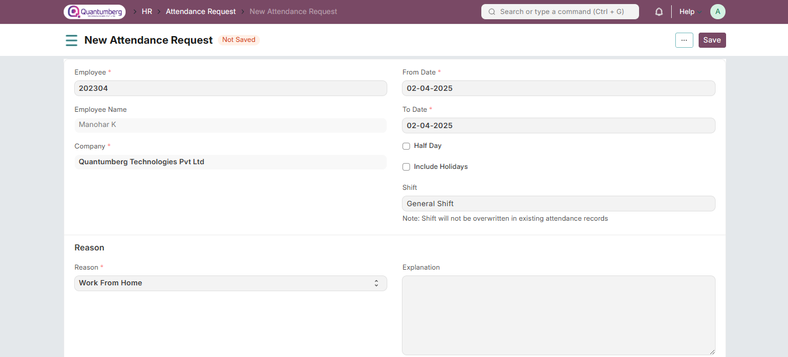

# Attendance Request

**The Attendance Request allows employees to submit requests for missing attendance due to reasons like on-site duty or work from home. It can also be used for Attendance Regularization to update existing records.**

To access Attendance Request:

    Home > Human Resources > Attendance > Attendance Request

**1. Prerequisites**

Before creating an Attendance Request, ensure the following is created:

* [Employee](../Organization%20Management/Employee.md)

**2. How to Create an Attendance Request**

1. Go to the Attendance Request list and click on New.

2. Select the Employee submitting the request.

3. Choose the From Date and To Date.

4. Enable **"Include Holidays"** if attendance needs to be marked for holidays (available from v15).

5. Select the Reason and add an Explanation (optional).

6. Click Save and Submit.

    Note 1: To request attendance for Half Day, check the Half Day checkbox and enter the date.

    Note 2: Once submitted, Attendance records will be automatically created for the mentioned dates.

As seen below, respective Attendance records are linked with the submitted Attendance Request.

If you cancel the Attendance Request, the linked Attendance documents created will be cancelled as well.

# 3. Features

# 3.1 Overwrite an Existing Attendance Record

If an employee was incorrectly marked Absent (e.g., via Auto Attendance), they can submit a request to rectify it. Once approved, the Attendance record will be updated.

Approval workflows can be set up for better control.

# 3.2 Request for Attendance in Bulk

Employees can also request for attendance for an entire month or week. On submission, attendance marking is skipped for holidays or leave days.

You can enable "Include Holidays" if you want to mark attendance for holidays too.

# 4. Related Topics

1. Employee Attendance Tool

2. Shift Management

3. Auto Attendance

4. Upload Attendance

5. Attendance