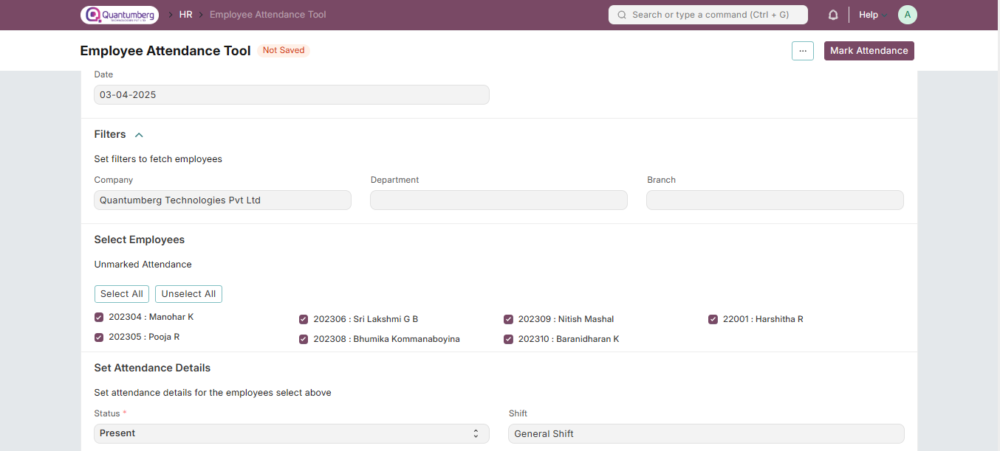
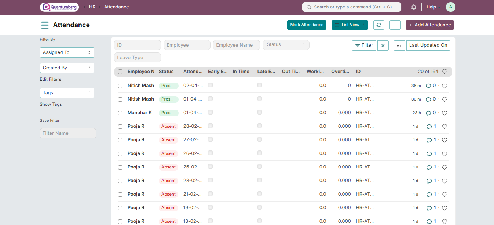

# Employee Attendance Tool

**The Employee Attendance Tool allows you to mark attendance for multiple employees on a particular date.**

To access the Employee Attendance Tool:

    Home > Human Resources > Attendance > Employee Attendance Tool

This tool helps quickly add attendance records for multiple employees based on their Department and Branch for a given day.

**1. Prerequisites**

Before marking attendance, ensure the following are created:

* [Employee](../Organization%20Management/Employee.md)

* [Department](../Organization%20Management/Department.md)

* [Branch](../Organization%20Management/Branch.md)

**2. How to Mark Attendance Using Employee Attendance Tool**

1. Enter the Date.

2. Select the Department and Branch (optional).

3. Choose the Employees.

4. Mark them as Present, Absent, or Half Day as required.

5. Optionally, select the Shift and mark employees with Late Entry or Early Exit.

6. The Marked Attendance table will display all employees with their attendance status.

7. Use column filters to search for specific employees or statuses.

    Note: Attendance cannot be marked for future dates.

Once marked, the attendance records are saved in the Attendance module.

**3. Related Topics**

1. Attendance

2. Attendance Request

3. Upload Attendance

4. Shift Management

5. Auto Attendance