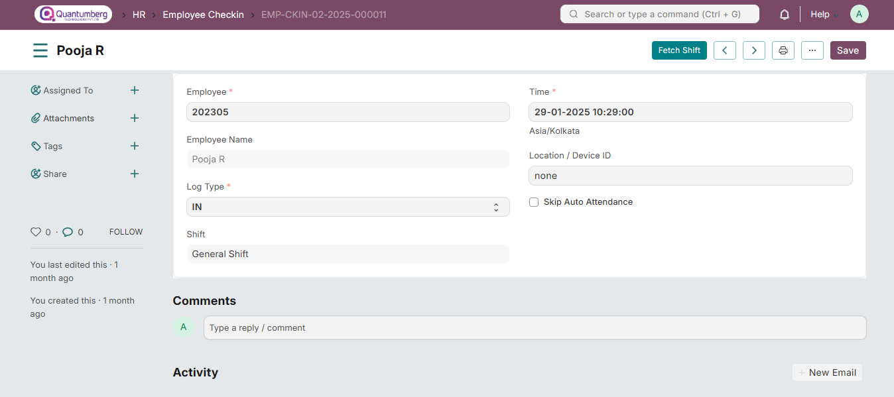
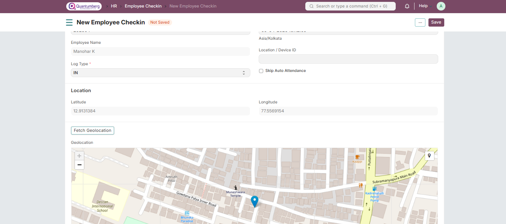

# Employee Checkin

Employee Checkin is used to log all employee check-ins and check-outs, which helps in managing attendance, shifts, and work hours.

# 1. Prerequisites

To create an Employee Checkin, ensure the following are created:

* [Employee](../Organization%20Management/Employee.md)

For shift-based check-ins and auto-attendance, also set up:

* [Shift Type](..)

* [Shift Assignment](../) or a default shift in the Employee master

# 2. How to Create an Employee Checkin

# 2.1 Creating Logs Manually

To create a manual Employee Checkin:

    Human Resources > Attendance > Employee Checkin

1. Click on New.

2. Select the Employee.

3. Set the date and time for the log.

4. Set Log Type as IN/OUT.

5. Save.

6.  If shifts are configured, the check-in will auto-assign the correct shift after saving. If the wrong shift is picked, use the Fetch Shift button (before attendance is marked).

7. Use Skip Auto Attendance if this check-in should not be considered for automatic attendance.

8. You can also capture the Location or Biometric Device ID.

If Auto Attendance is enabled, the Attendance record will be automatically linked to the corresponding set of check-ins after processing.

# 2.2 Integrating Q-Dynamics HR with Biometric Devices

If you are using a Biometric Device to log employee check-ins and check-outs, you can use it to create records in Q-Dynamics HR. You can read more about this [here].

# 3. Features

# 3.1 Geolocation Tracking

You can also track geolocation in employee check-ins. To enable this, go to HR Settings and enable "Allow Geolocation Tracking".

You can then click on the "Fetch Geolocation" button in the check-in form to fetch your current location.

If geolocation tracking has been enabled, it will be automatically captured while checking in from the mobile app too.