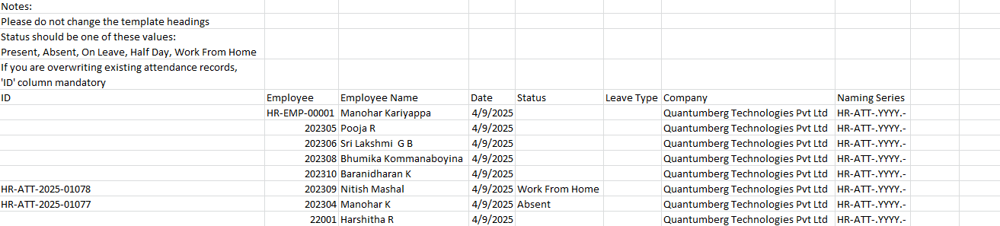
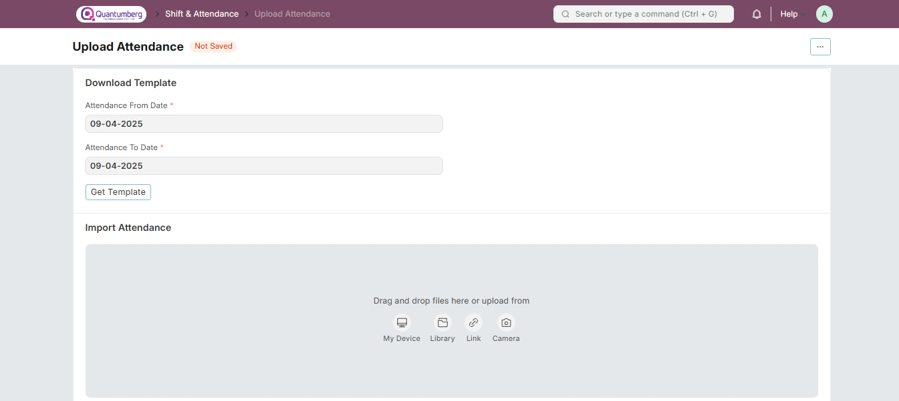

# Upload Attendance

**The Upload Attendance tool helps you upload attendance in bulk using a CSV file.**

To access Upload Attendance:

    Home > Human Resources > Attendance > Upload Attendance

# 1. Prerequisites

Before uploading attendance, ensure the following is created:

* [Employee](../Organization%20Management/Employee.md)

# 2. How to Upload Attendance in Bulk

1. Enter the Attendance From Date and Attendance To Date.

2. Click the ‘Get Template’ button to download the CSV file containing Employee Details.

3. In the CSV file, enter the Attendance Status (Present / Absent) for the selected dates.

4. Save the file.

5. Upload the saved file via the tool.

Once uploaded, Attendance records will be automatically created for the selected employees and dates.

# 3. Related Topics

1. Employee Attendance Tool

2. Shift Management

3. Auto Attendance

4. Attendance Request

5. Attendance