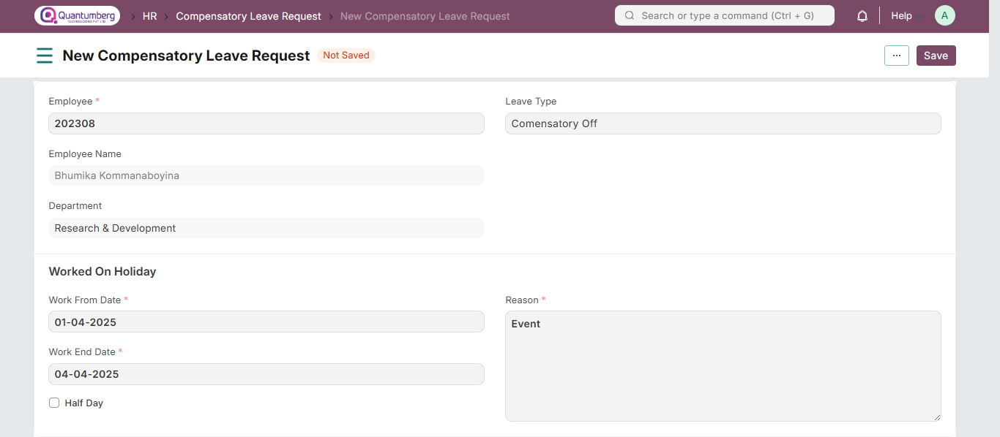

# Compensatory Leave Request 

**Compensatory Leave is a leave that is granted to an Employee as compensation for working overtime or on holidays.**

Q-Dynamics HR allows Employees to request for Compensatory Leaves through the Compensatory Leave Request document. It is necessary that the dates mentioned in the Compensatory Leave Request should be in default Holiday List and also that the Employee should have their attendance marked Present.

    Note: Only Leave Types which are marked as 'Is Compensatory' can be selected in the Compensatory Leave Request.

To access Compensatory Leave Request, go to:

    Home > Human Resources > Leaves > Compensatory Leave Request

# 1. Prerequisites 

Before creating a Compensatory Leave Request, it is necessary to create the following documents:

* [Employee](../Organization%20Management/Employee.md)

* [Leave Period](../LeaveManagement/LeavePeriod.md)

* [Leave Type](../LeaveManagement/LeaveType.md)

* [Leave Policy](../LeaveManagement/LeavePolicy.md)

* [Leave Allocation](../LeaveManagement/LeaveAllocation.md)

* [Holiday List](../LeaveManagement/HolidayList.md)

* [Attendance](../Attendance/Attendance.md)

# 2. How to create a Compensatory Leave Request 

1. Go to Compensatory Leave Request list, click on New.

2. Select the Employee ID. Once selected, The Employee Name and Department will get automatically fetched.

3. Select Leave Type.

4. Select Work From Date and Work End Date. This is the date of the day(s) the Employee has worked on, during a Holiday.

5. Enter the Reason.

6. Save and Submit.

On submitting the Compensatory Leave Request, Q-Dynamics HR updates the Leave Allocation record for the Compensatory leave type, allowing the Employee to apply for leaves of this type later on depending upon the number of leaves left.

# 3. Related Topics 

1. [Leave Application](../LeaveManagement/LeaveApplication.md)

2. [Leave Encashment]()

3. [Leave Block List]()