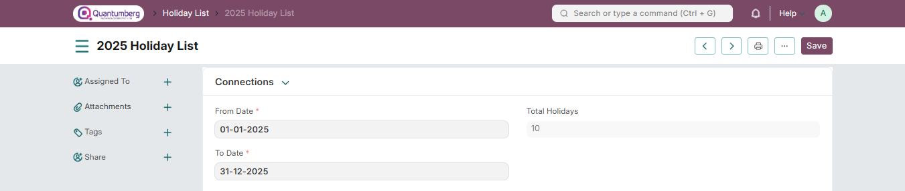

# Holiday List

Holiday List is a list which contains the dates of holidays.

Most organizations have a standard Holiday List for their employees. However, some of them may have different holiday lists based on different Locations or Departments. In Q-Dynamics HR, you can configure multiple Holiday Lists and assign them to your employees based on your requirements.

To access Holiday List, go to:

    Home > Human Resources > Leaves > Holiday List

# 1. How to create a Holiday List

1. Go to Holiday List, click on New.

2. Enter Holiday List Name. It can be based on the Fiscal Year or Location or Department as per the requirement.

3. Select From Date and To Date for the Holiday List.

# 2. Features

Some of the additional features in the Holiday List are as follows:

# 2.1 Adding Weekly Holidays

You can quickly add Weekly Offs in the Holiday List as follows:

1. In the 'Add Weekly Holidays' section, select the day in the Weekly Off field.

2. Click on the 'Add to Holidays' button.

# 2.2 Adding Local Holidays 

You can quickly add local holidays to the Holiday List as follows:

1. In the 'Add Local Holidays' section, select the country.

2. Some countries have subdivisions with different or additional holidays. If you like, you can optionally select a specific subdivision.

3. Click on the 'Add to Holidays' button.

Can't find your country for fetching local holidays in Holiday List? 

Q-Dynamics HRuses an external package Holidays to get predictable holiday dates for countries. These are the list of countries supported:

https://holidays.readthedocs.io/en/latest/#available-countries

If your country is not listed here, you will have to manually add local holidays. If you are a developer, you can also consider contributing your country’s holidays to the original repository.

# 2.3 Adding Holidays manually 

You can also add specific days manually by clicking on the 'Add row' option in the Holidays table.

# 3. Holiday List in Company

You can set a default Holiday List at the company-level in the Company master using the 'Default Holiday List' field.

# 4. Holiday List in Employee

If you have created multiple Holiday Lists, you can select a specific Holiday List for an Employee in their respective master.

When an employee applies for leave, the days mentioned in the assigned Holiday List will not be counted, as they are already designated as holidays.

    Note: If a Holiday List is specified in the Employee master, it will take priority over the default 
    Holiday List set in the Company master.You can create and manage multiple holiday lists as needed. 
    For example, if you have a factory, you can maintain separate lists for factory workers and office 
    staff. These can be easily managed by linking the appropriate Holiday List to each Employee.

# 5. Holiday List in Workstation

You can also assign a Holiday List at the Workstation-level as shown in the screenshot below.

The dates in the Holiday List tagged in the Workstation master will be considered as the days the Workstation will remain closed.

# 6. Related Topics 

1. Leave Allocation
2. Leave Period
3. Leave Policy
4. HR Settings