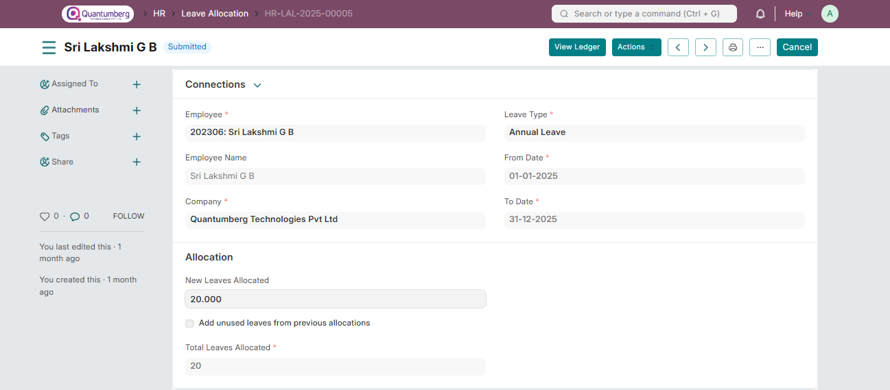

# Leave Allocation 

**Leave Allocation enables you to allocate a specific number of leaves of a particular type to an Employee.**

To access Leave Allocation, go to:

    Home > Human Resources > Leaves > Leave Allocation

# 1. Prerequisites 

Before creating a Leave Allocation, it is advisable you create the following documents:

* [Employee](../Organization%20Management/Employee.md)

* [Leave Type](../LeaveManagement/LeaveType.md)

* [Leave Period](../LeaveManagement/LeavePeriod.md)

* [Leave Policy](../LeaveManagement/LeavePolicy.md)

# 2. How to create a Leave Allocation 

1. Go to Leave Allocation list, click on New.

2. Select the Employee, Leave Type, From Date and To Date.

3. Enter the number of New Leaves Allocated for that particular Leave Type.

4. Save and Submit.

    Note: Enable the 'Add unused leaves from previous allocations' option in case you want to carry forward unused 
    leaves from the previous allocation period for this particular Leave Type.

# 3. Features 

**1. Manually adding leaves to the current allocation** 

If your earned leave allocation failed due to some reasons like background jobs weren’t running, you can manually allocate leaves for an allocation

Click on **Actions > Allocate Leaves**

And set the number of leaves you want to allocate. You can also set the From Date from when these leaves will be applicable. By default, it will consider today’s date.

Click on allocate to add leaves to the balance

# 4. Related Topics 

1. Leave Application

2. Compensatory Leave Request

3. Leave Encashment

4. Leave Block List

5. Holiday List