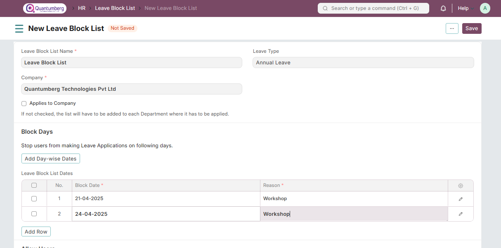

# Leave Block List 

**Leave Block List is a list of dates in a year, on which employees cannot apply for leave.**

To access Leave Block List, go to:

    Home > Human Resources > Leaves > Leave Block List

Q-Dynamics HR allows you to define a list of Leave Approvers who can approve Leave Applications on blocked days, in case of urgency. You can also define whether the list will be applied to the entire company or on any specific departments.

# 1. Prerequisites 

Before you create a Leave Block List, it is advisable you have the following documents:

* [Company]()

* [Department]()

* [Leave Period](../LeaveManagement/LeavePeriod.md)

* [Holiday List](../LeaveManagement/HolidayList.md)

# 2. How to create a Leave Block List 

1. Go to Leave Block list, and click on New.

2. Enter Leave Block List Name.

3. Enter Block Date and Reason in the 'Leave Block List Dates' table.

4. Enter Users to approve Leave Applications for Blocked Days in the 'Leave BLock List Allowed' table.

5. Save.

    Note: Enable the 'Applies to Company' option if you want the Leave Block List to be applicable for the 
    entire Company. If not checked, the list will have to be added to each Department where it has to be applied.

# 3. Related Topics 

1. [Leave Type](../LeaveManagement/LeaveType.md)

2. [Leave Period](../LeaveManagement/LeavePeriod.md)

3. [Leave Policy](../LeaveManagement/LeavePolicy.md)

4. [Leave Allocation](../LeaveManagement/LeaveAllocation.md)

5. [Leave Application](../LeaveManagement/LeaveApplication.md)

