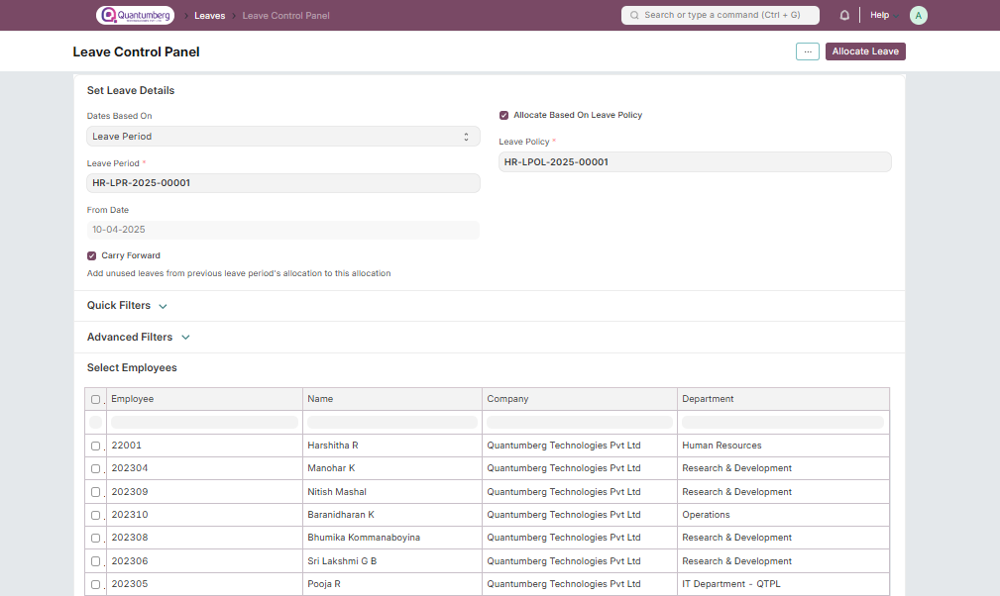

# Leave Control Panel 

The Leave Control Panel allows you to allocate leaves in bulk based on a specific Leave Policy or Leave Type.

    Home > Human Resources > Leaves > Leave Control Panel

# 1. Prerequisites 

Before using the Leave Control Panel, it is advisable to create the following documents:

* [Employee](../Organization%20Management/Employee.md)

* [Leave Period (optional)](../LeaveManagement/LeavePeriod.md)

* [Leave Policy /](../LeaveManagement/LeavePolicy.md) [Leave Type](../LeaveManagement/LeaveType.md)

# 2. How to allocate leave using the Leave Control Panel 

1. Choose the appropriate option from Dates Based On and fill in the corresponding data. This would include Leave Period or From Date and/or To Date.

2. If you wish to assign a Leave Policy, select the intended one. Alternatively, you can allocate leave directly by disabling Allocate Based On Leave Policy, selecting the desired Leave Type, and filling in the corresponding number of New Leaves Allocated.

3. Select Carry Forward if you wish to add unused leaves from the previous allocation into this one.

4. Use Quick Filters for filtering employees based on specific fields, or add additional custom filters through Advanced Filters.

5. Select suitable employees from the Select Employees table below and click on the Allocate Leave button at the top right corner.

    Note: Leave cannot be allocated for past dates.

[Leave Policy Assignments](../LeaveManagement/LeavePolicyAssignment.md) and [Leave Allocations](../LeaveManagement/LeaveAllocation.md) made using the Leave Control Panel are reflected in their respective DocTypes as shown below:

* Leave Policy Assignment

* Leave Allocation