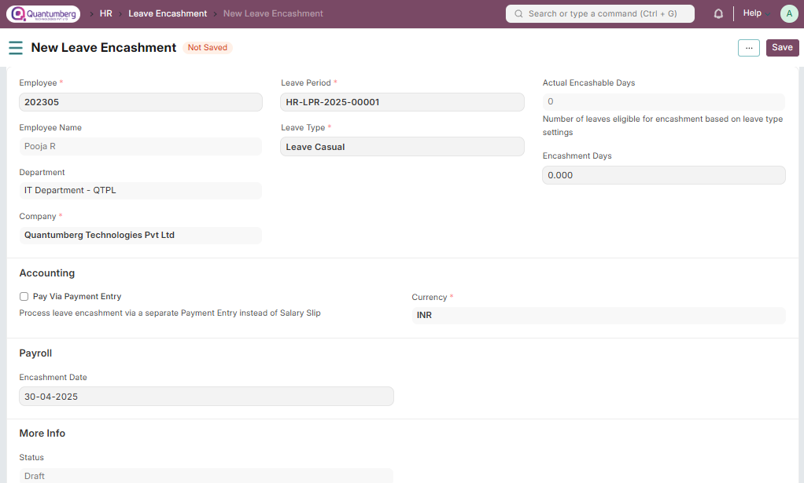

Leave Encashment 
**Leave Encashment refers to an amount of money received in exchange for Leaves not availed by an Employee. You can submit Leave Encashment for Leave Types which are encashable.**

To access Leave Encashment, go to:

    Home > Human Resources > Leaves > Leave Encashment

# 1. Prerequisites 

Before creating Leave Encashment, it is advisable you create the following documents:

1. [Employee](../Organization%20Management/Employee.md)

2. [Leave Type](../LeaveManagement/LeaveType.md)

3. [Leave Policy](../LeaveManagement/LeavePolicy.md)

4. [Leave Period](../LeaveManagement/LeavePeriod.md)

5. [Salary Structure]()

6. [Salary Structure Assignment]()

# 2. How to create a Leave Encashment 

1. Go to Leave Encashment list, click on New.

2. Select Leave Period.

3. Select the Employee. Once the Employee is selected, the Employee's Department is automatically fetched.

4. Select Leave Type for which the Leave is encashed. Make sure the Leave Type is encashable (the 'Allow Encashment' checkbox in the Leave Type is checked).

5. Select Encashment Date, if you want payment via Salary Slip. Based on the date selected, the amount will be encashed in that particular Payroll Entry.

6. Save and Submit.

    Note: As you select Employee and Leave Type, Leave Balance and Encashable Days (which is total leave 
    balance minus the threshold days set in Leave Type) will be shown along with the Encashment Amount
    based on the Leave Encashment per day as configured in the Employee's assigned Salary Structure.

# 3. Leave Encashment Payment Methods 

In Q-Dynamics HR, we allow you to pay the encashment amount via Salary Slip or Payment Entry.

# 3.1 Payment via Payment Entry 

1. To pay the Leave Encashment amount via Payment Entry you need to check Pay via Payment Entry checkbox.

2. After that, it will allow you to select Payable Account and Expense Account.

3. After Submitting the record click on the button "Create Payment Entry" which will redirect you to the Payment Entry Form fill in the details, save, and submit.

# 3.2 Payment via Salary Slip 

1. To pay the Leave Encashment amount via Salary Slip you need to make sure that checkbox Pay via Payment Entry is unchecked.

2. Select the Encashment Date. Based on the date selected, the amount will be encashed in that particular Payroll Entry. Save and Submit. On submitting a Leave Encashment for an 

3. Employee, Q-Dynamics HR automatically creates an Additional Salary which will get added to the Salary Slip of the Employee when processing the payroll.

# 4. Related Topics 

1. [Payroll Period]()

2. [Payroll Entry]()

3. [Additional Salary]()