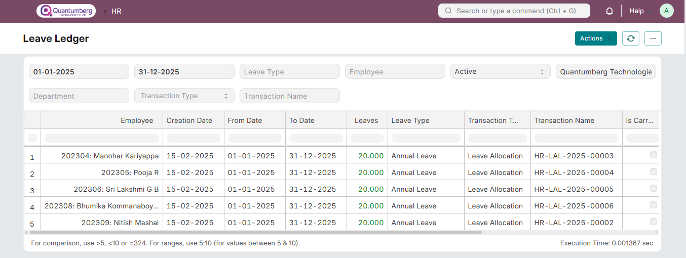

# Leave Ledger Report 

This report allows you to view the ledger impact for all your leave-related transactions:

1. Leave Allocation

2. Leave Application

3. Leave Encashment

This report gives you an overview of:

1. Ledger entry creation date

2. Ledger transaction dates (From Date - To Date)

3. Leaves (added/consumed/deducted)

4. Leave Type

5. Linked transaction details (Type & Name)

6. Any special flags: Is Carry Forward, Is Expired, Is Leave Without Pay

7. Company & Holiday List linked to it

You can use the **View Ledger** button in transactions to view the linked ledger entries in the report view

