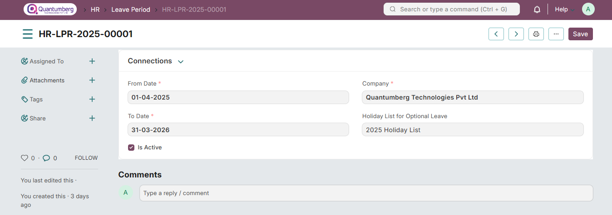

# Leave Period 

A Leave Period is a duration of time for which leaves are allocated.

Most companies manage leaves based on a Leave Period, corresponding to a calendar year or the fiscal year. To access Leave Period, go to:

    Home > Human Resources > Leaves > Leave Period

# 1. Prerequisites 

Before creating a Leave Period, it is advisable to create the following:

* [Company]()
* [Holiday List](../LeaveManagement/HolidayList.md)

# 2. How to create a Leave Period 

1. Go to Leave Period list, click on New.

2. Enter the From Date and To Date of the Leave Period.

3. Select the Company name for which the Leave Period is applicable.
4. Save.

The Leave Period also allows you to select a Holiday List for Optional Leaves (optional) which will be considered for allocating Optional Leaves for the period.

    Note: The 'Holiday List for Optional Leaves' is not the same as the usual 'Holiday List'. This list will 
    contain a list of optional holidays only. 'Holiday List for Optional Leaves' can be created from 
    the Holiday List document. You can create two Holiday Lists for a Leave Period; one containing the usual 
    set of holidays and the other for optional holidays.

Additionally, you can check the 'Is Active' checkbox if you want to enable this particular Leave Period.

# 3. Granting leaves based on Leave Period 

To grant leaves based on Leave Period, use the Leave Policy Assignment.

# 4. Related Topics 

1. [Leave Allocation]()

2. [Leave Policy]()

3. [Leave Type](../LeaveManagement/LeaveType.md)