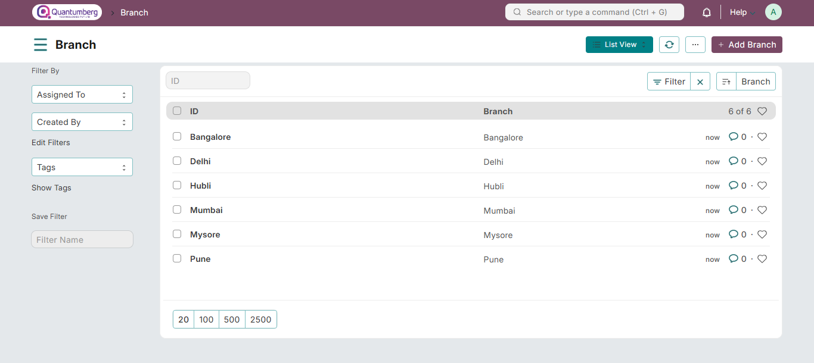

# Branch

**A Branch office is an outlet of a company located at a different location other than the main office.**

QuantumBerg HRMS allows you to create and maintain a record of the different branches of your organization.

To access Branch, go to:

    Home > Human Resources > Employee > Branch

**1. Prerequisites**

Before creating a Branch, it is mandatory to create the following document:

[Company](../Organization%20Management/Company.md)

**2. How to create a Branch**

1. Go to the Branch list, Click on **New**.

2. Enter the name of the Branch.

3. Click **Save**.

You can link the Branch to the Employee master.

**3. Related Topics** 

1. [Employee](../Organization Management/Employee.md)

2. [Employment Type](../Organization Management/EmploymentType.md)

3. [Department](../Organization Management/Department.md)

4. [Designation](../Organization Management/Designation.md)

5. [Employee Grade](../Organization Management/EmployeeGrade.md)

6. [Employee Group](../Organization Management/EmployeeGroup.md)
