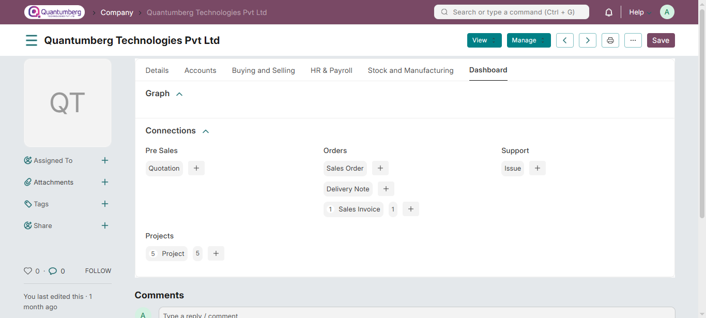

# Company Setup
**A company is a legal entity made up of an association of people for carrying on a commercial or industrial enterprise.**

In ERP Application, the first Company is created when an ERP Application account is set up. For each Company, you can set a domain as manufacturing, retail, or services depending on the nature of your business activity.

If you have more than one company, you can add them from:

    Home > About > Company

# 1. How to create a new Company
1. Go to the Company list, click on **New**.
2. Enter the name, abbreviation, and default currency for the company.
3. **Save**.

