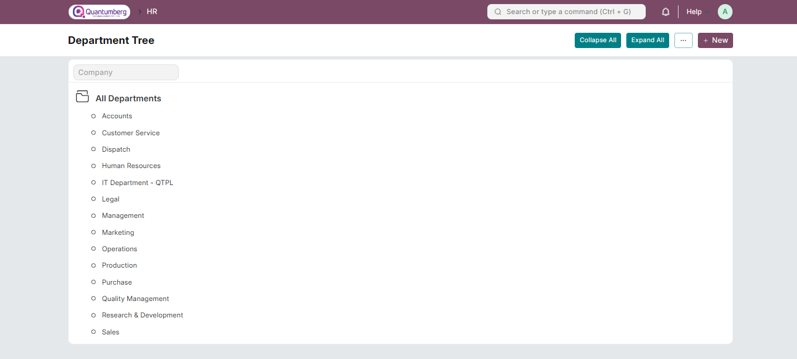
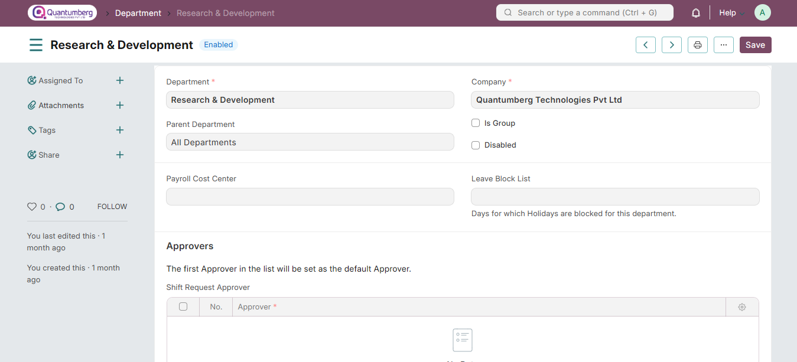
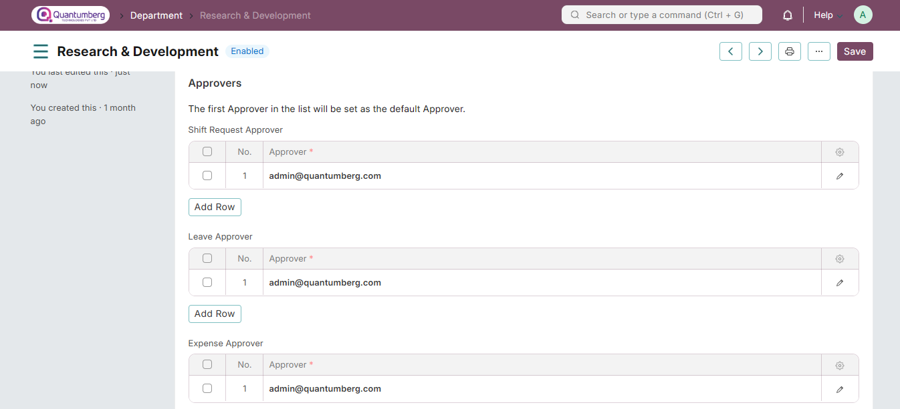

# Department

**A Department is a specialized functional area or a division within an organization.**

You can configure the Departments in your organization, set a Leave Block List, and assign Leave and Expense Approvers for each department.

To access Department, go to:

    Home > Human Resources > Employee > Department

Department is a tree-structured master, meaning you can create parent departments and sub-departments, as shown below:

    Note: The "Is Group" checkbox must be checked if the Department is a parent department.

**1. Prerequisites**

Before creating a Department, it is advisable to create the following document:

[Company](../Organization%20Management/Company.md)

**2. How to Create a Department**

1. Go to the Department list, Click on **New**.

2. Enter the Department name.

3. Select the Company name.

4. Select a Leave Block List (Optional) applicable to this department.

5. Click **Save**.

**3. Features**

**3.1 Leave and Expense Approvers**

You can assign Leave and Expense Approvers for a particular Department in the "Leave Approver" and "Expense Approver" tables, respectively.

    Note: Multiple Leave and Expense Approvers can be assigned to a Department. However, the first Approver in the 
    list will be set as the default Approver.

**4. Related Topics**

1. [Employment Type](../Organization Management/EmploymentType.md)

2. [Employee Grade](../Organization Management/EmployeeGrade.md)

3. [Employee Branch](../Organization Management/Branch.md)

4. [Employee Designation](../Organization Management/Designation.md)
