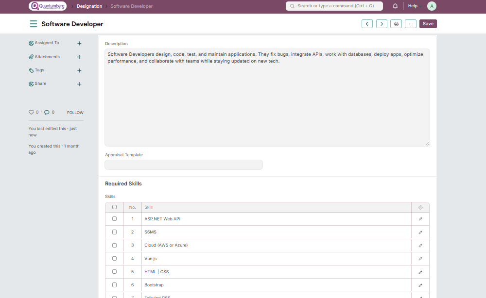

# Designation

**Designations are the official job titles assigned to employees.**

In company management, various stakeholders—such as directors, officers, managers, and shareholders—guide the organization toward achieving its business objectives.

Q-Dynamics  HRMS allows you to create different Designations and specify the skills required for each role.

To access Designation, go to:

    Home > Human Resources > Employee > Designation

**1. How to create a Designation**

1. Go to Designation list, click on **New**.

2. Enter the Designation name.

3. Enter Description and Required Skills (optional).

4. **Save**.

    Note: The skills required for an Employee in a particular Designation, specified in the "Required Skills" 
    section of the Designation document, can be directly fetched in the Employee Skill Map to evaluate an 
    employee's performance based on their skills.

**3. Related Topics**

1. [Employee](../Organization Management/Employee.md)

2. [Employment Type](../Organization Management/EmploymentType.md)

3. [Employee Branch](../Organization Management/Branch.md)

4. [Department](../Organization Management/Department.md)

5. [Employee Grade](../Organization Management/EmployeeGrade.md) 

6. Employee Skill Map