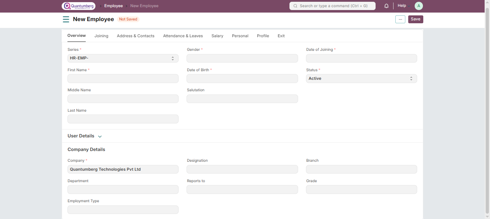

# Employee

**An individual who works part-time or full-time under a contract of employment and has recognized rights and duties in your company is your Employee.**

In Q-Dynamics  HRMS, you can manage the Employee master. It captures the demographic, personal, and professional details, joining and leave details, etc. of the Employee.

To access the Employee master, go to:

    Home > Human Resource > Employee

**1. Prerequisites**
Before creating an Employee, it is advised to create the following:

* [Company](Company.md)

**2. How to create an Employee**

1. Go to the Employee list, and click on **New**.
2. Enter the Employee's personal details such as Name, Gender, Date of Birth, Date of Joining  
3. Click **Save**.

As shown below, all the mandatory fields are marked with red asterisks.

**3. Features**

Apart from the aforementioned mandatory details, some additional details that can be captured in the Employee master are as follows:

**3.1 Employment Type**

You can set an Employment Type such as Intern, Contract, Full-time, Part-time, Probation, etc. for an Employee.

**3.2 Create User**

The User ID can be linked to the Employee. In case the User ID is not created, you can click on "Create a New User" in the dropdown to create one.

By clicking on the "Create User Permission" checkbox, the Employee's access to other records can be restricted. Check Adding Users to learn how to create users and add permissions.

**3.3 Joining Details**

The Joining Details of the Employee, such as the Offer Date, Confirmation Date, Contract End Date, Notice (Days), and Date of Retirement, can be captured.

**3.4 Department and Grade**

In a company, Employees are usually grouped based on Department, Grade, Designation, and Branch.

In the Department and Grade section, these details of the Employee can be saved. In the "Reports to" field, the person to whom the Employee reports can be captured.

**3.5 Leave Details**

In Leave Details, you can save the Leave Policy and Holiday List details. The Leave Policy specifies the type and number of leaves an Employee is entitled to, while the Holiday List contains the dates of holidays and weekly offs.

**3.6 Salary Details**

Here, the mode of salary payment—Bank Transfer, Cheque, or Cash—can be selected.

**3.7 Contact Details**

Employee's contact information, such as Mobile Number, Current and Permanent Address, Personal and Company Email ID, can be captured here.

In the Preferred Email ID field, either the Company Email, Personal Email, or User ID of the Employee can be selected depending on the user's preference.

**3.8 Personal Details**

Personal details of the Employee, such as Family Background (including name and occupation of parents, spouse, and children), Passport Details (including date and place of issue), and Health Details (height, weight, allergies, medical concerns, etc.), can be saved.