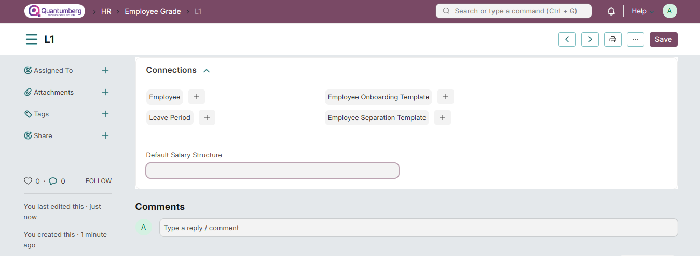
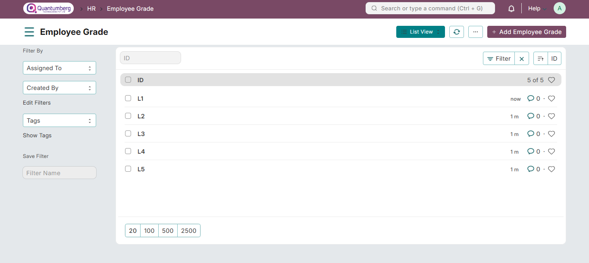

# Employee Grade

**An Employee Grade is a grouping of employees with similar positions or values, used to assign compensation rates and salary structures.**

Q-Dynamics  HRMS allows you to configure Employee Grades, making it easy to categorize employees based on seniority or other criteria.

Employee Grades also help in fetching employee records in bulk for payroll processing, leave allocation, and other HR operations.

To access Employee Grade, go to:

    Home > Human Resources > Employee > Employee Grade

**1. Prerequisites**

Before creating an Employee Grade, it is advisable to create the following documents:

* Leave Policy

* Salary Structure

**2. How to Create an Employee Grade**

1. Go to the Employee Grade list,Click on **New**.

2. Enter the Name of the Employee Grade.

3. Enter the Default Leave Policy and Default Salary Structure for that Grade.

4. Click **Save**.

Shown below are different Employee Grades created.

You can also access Employee, Leave Period, Employee Onboarding Template, Employee Separation Template

**3. Related Topics**

1. Leave Type