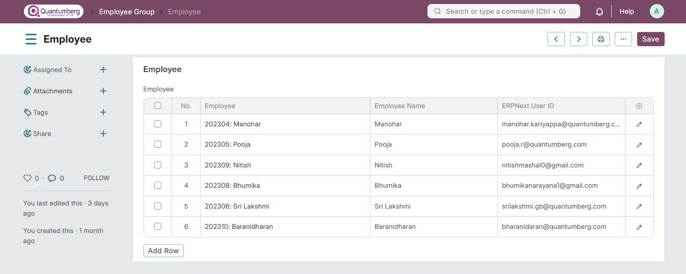

# Employee Group

**An Employee Group is a way to categorize employees based on attributes such as Designation, Grade, Branch, etc.**

To access Employee Group, go to:

    Home > Human Resources > Employee > Employee Group

**1. Prerequisites**

Before creating an Employee Group, it is advisable to create the following document:

* [Employee](../Organization%20Management/Employee.md)

**2. How to Create an Employee Group**

1. Go to the Employee Group list, Click on **New**.

2. Enter the Name of the Employee Group.

3. Select and add Employee ID to the group (the Employee Name will be fetched automatically).

4. Click **Save**.

**3. Features**

**3.1 Service Level Agreement (SLA)**

An Employee Group can be linked to the Service Level Agreement (SLA) document, where the Service Level can be specified for that particular group.

**4. Related Topics**

1. [Employment Type](../Organization Management/EmploymentType.md)

2. [Branch](../Organization Management/Branch.md)

3. [Department](../Organization Management/Department.md)

4. [Designation](../Organization Management/Designation.md)

5. [Employee Grade](../Organization Management/EmployeeGrade.md)