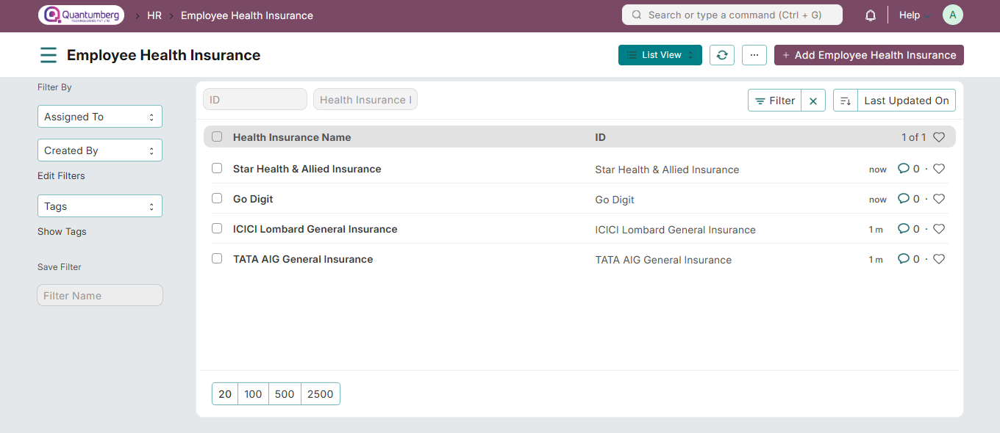

# Employee Health Insurance

**Employee Health Insurance is a benefit provided by a company, where the employer pays full or partial premiums for an employee's health insurance policy.**

QuantumBerg HRMS allows you to save Employee Health Insurance details and link them to the respective Employee's master record.

To access Employee Health Insurance, go to:

    Home > Human Resources > Employee > Employee Health Insurance

**1. How to Create an Employee Health Insurance**

1. Go to the Employee Health Insurance list, Click on **New**.

2. Enter the Health Insurance Name.

3. Click **Save**.

Additionally, in the Employee master, you can attach the Health Insurance Provider Name and fill in the Health Insurance Number.

**2. Related Topics**

1. [Employee](../Organization%20Management/Employee.md)