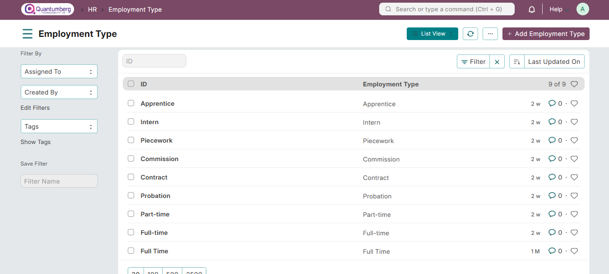

# Employment Type

**You can employ people under a number of categories, each having its own wage and leave entitlements. This is called an Employment Type.**

Q-Dynamics  HRMS allows you to select an Employment Type from a pre-defined list or even create a new one based on your requirements.

To access the Employment Type, go to:

    Home > Human Resources > Employee > Employment Type

**1. How to create an Employment Type**

1. Go to the Employment Type list, click on **New**.
2. Enter the Name of the Employment Type.  
3. Click **Save**.

The Employment Type can be linked to the Employee master.

**2. Related Topics**

1. [Employee](../Organization Management/Employee.md)

2. [Employment Type](../Organization Management/EmploymentType.md)

3. [Branch](../Organization Management/Branch.md)

4. [Department](../Organization Management/Department.md)

5. [Designation](../Organization Management/Designation.md)

6. [Employee Grade](../Organization Management/EmployeeGrade.md)
