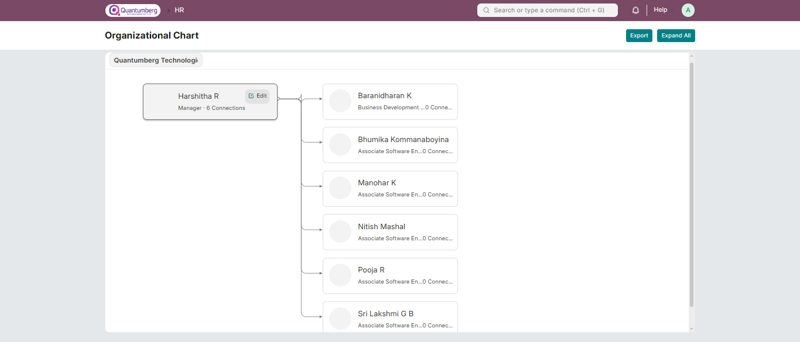

# Organizational Chart

**An Organizational Chart shows the structure of an organization by depicting connections between employees, including their designation, image, and name.**

In large organizations where it’s difficult to remember names, people can interact with the Org Chart to understand the hierarchy through faces and other details.

To access Organizational Chart, go to:

    Home > Human Resources > Employee > Organizational Chart

* The Org Chart is created based on the "Reports To" field in the Employee Master.

* Employees who don’t report to anyone appear at the first level.

* The chart expands horizontally on desktop view and vertically on mobile.

* Each node displays the Employee Name, Image, Designation, and total number of connections.

* Connections represent the total number of descendants a node has until the end of the hierarchy.

* The edit button in each node navigates to the Employee Master.

* As you navigate, the active hierarchy is highlighted.

* The Company filter allows you to view the org chart for individual companies.

