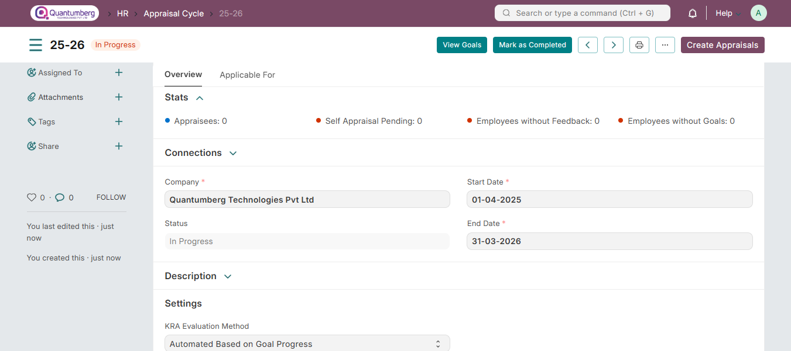
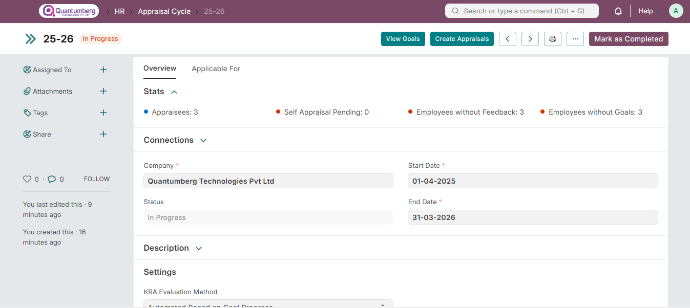

# Appraisal Cycle 

An Appraisal Cycle is a defined period of time during which the overall performance of an employee is assessed.

To create an Appraisal Cycle, go to:

    Home > Human Resources > Performance > Appraisal Cycle

# 1. Prerequisites 

Before creating an Appraisal Cycle, you should create [Appraisal Templates](../Performance/AppraisalTemplate.md) for different designations.

You can link them in the Designation master for fetching them automatically in the cycle or manually select relevant templates in the Appraisees child table.

# 2. How to create an Appraisal Cycle 

1. Go to the Appraisal Cycle list, and click on New.

2. Enter the Cycle Name.

3. Select the Company and set the Start and End dates.

4. Select the KRA Evaluation Method:

    * **Automated Based on Goal Progress (Default):** Your KRA/Goal score will be automatically calculated based on your goal completion linked to that KRA. You can read more about here.

    * **Manual Rating:** You can choose to rate Goals/KRAs manually. This is the original evaluation method used until.

5. By default, the Final Score is calculated as the average of Goal Score, Feedback Score, and Self Appraisal Score. To calculate final score using your own formula, enable **Calculate Final Score based on Formala** and enter the formula expression.

# 3. Actions 

# 3.1 Create Appraisals 

You can create appraisals in bulk from the Appraisal Cycle.

1. In the "Applicable For" tab, set relevant filters to fetch the employees included in this cycle. You can choose to create separate cycles for a particular Branch, Department, or Designation. Ex: Engineering could have an yearly cycle but Sales might need a half-yearly cycle.

2. After setting the filters, click on the Get Employees button and save. This will fetch the employees based on the set filters.

3. You can check the Employees table to find the fetched employees. You can add more employees to be included in the cycle manually by clicking on the Add Row button.

4. Click on the Create Appraisals button. This will create all the Appraisal documents for the selected employees.

5. Click on Start button to start the cycle.

If an employee joins after the cycle has already started, you can:

* Create an Appraisal document for them separately and select the cycle.
* Or, add rows for new employees in the cycle's Employees child table, save and click on Create Appraisals again. This will create appraisals for the newly added employees.

# 3.2 View Goals 

With this button, you can view the goals linked to the cycle. This button will navigate you to the Goal Tree filtered by the Appraisal Cycle.

# 4. Features 

# 4.1 Appraisal Stats 

The Stats section in the cycle will give you an overview of:

* Appraisees: The number of appraisees included in the cycle

* Self Appraisal Pending

* Employees without Feedback

* Employees without Goals

# 5. Related Topics 

* Appraisal

* Goal

* Employee Performance Feedback