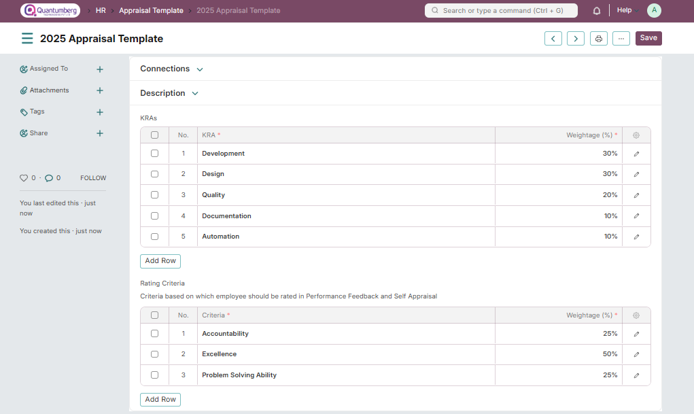
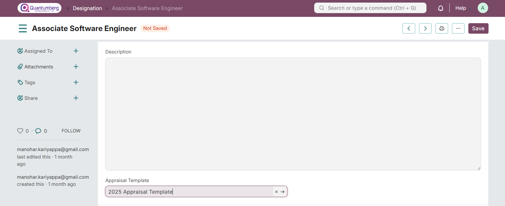
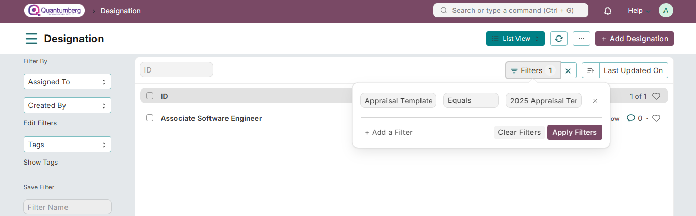

# Appraisal Template 

You can define the KRAs and Feedback Criteria based on which employees would be rated in the Appraisal Template.

To access Appraisal Template, go to:

    Home > Human Resources > Performance > Appraisal Template

# 1. Prerequisites 
Before creating an Appraisal Template, you should create the following:

* KRA: Key Result Areas master to align your goals against

* Employee Feedback Criteria: Criteria based on which employees should be rated in Performance Feedback and Self Appraisal

# 2. How to create an Appraisal Template 

1. Go to the Appraisal Template list, and click on New.

2. Enter a title for the Template. You can keep the title same as the Department or Designation you are creating the template for.

3. You can optionally set some description.

4. Add the KRAs (Key Result Areas) along with their weightages.

5. Add the Criteria based on which employees should be rated in Performance Feedback and Self Appraisal.

Once you create the templates, you can link them to the respective Designations.

You can link a template to multiple designations

# 3. Related Topics 

1. Appraisal

2. Employee Performance Feedback