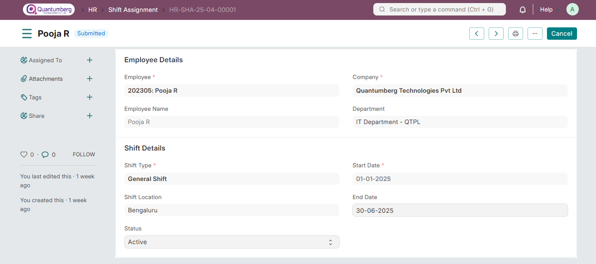
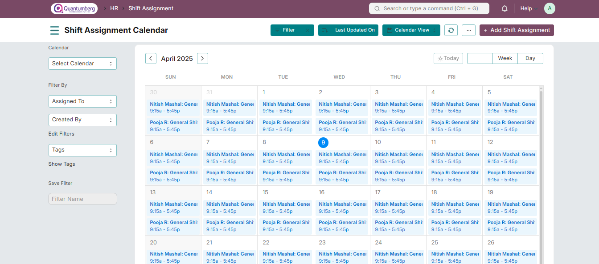

# Shift Assignment

# 1. Prerequisites

To create a Shift Assignment in Q-Dynamics HR, the following must be created first:

* [Employee](../Organization%20Management/Employee.md)

* [Shift Type](../ShiftManagement/ShiftType.md)

# 2. How to create a Shift Assignment

In some organizations, shifts are directly assigned to employees. In others, employees request a shift through a Shift Request. If the employee creates a Shift Request, once it is approved and submitted, it will automatically create a Shift Assignment for that employee.

To directly create a Shift Assignment, go to:

    Home > Human Resources > Shift Management > Shift Assignment

* Click on New

* Select the Employee

* Select the Shift Type

* Set the Start Date. If you want to assign this shift for a specific period, set an End Date.

* Save and Submit.

* You can set the Assignment as Inactive after submission too.

You can also switch to a calendar view to see shift schedules of multiple employees

# 3. Features 

# 3.1 Allow Multiple Shift Assignments for Same Date 

Multiple Shift Assignments on the same date for an employee can be enabled or disabled under the HR Settings.