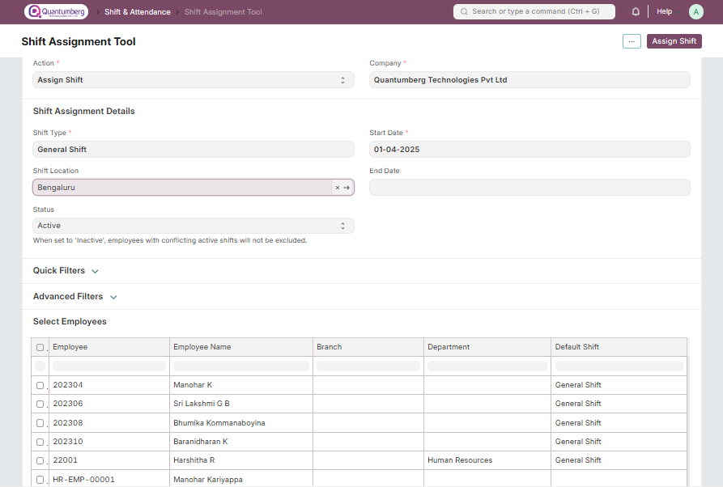

# Shift Assignment Tool

The Shift Assignment Tool allows you to assign shifts or process shift requests in bulk.

    Home > Human Resources > Shift Management > Shift Assignment Tool

# 1. Prerequisites

Before using the Shift Assignment Tool, it is advisable to create the following documents:

* [Employee](../Organization%20Management/Employee.md)

* [Shift Type](../ShiftManagement/ShiftType.md)

* [Shift Request](../ShiftManagement/ShiftRequest.md)

# 2. How to use the Shift Assignment Tool

# 2.1 Assigning Shifts

1. Set Action as 'Assign Shift' and select a Company if it hasn't been appropriately selected already.

2. Select the Shift Type that you wish to assign, along with the dates on which you wish to assign it. This will cause all employees without overlapping active Shift Assignments to be loaded in the Select Employees table below.

3. You can also assign inactive shifts by setting Status as 'Inactive'. Pre-existing overlapping shifts will be ignored in this case.

4. Use Quick Filters for filtering employees based on specific fields, or add additional custom filters through Advanced Filters.

5. Select suitable employees from the Select Employees table.

6. If everything looks good, click on the Assign Shift button at the top.

As a result, Shift Assignments will be created for the selected employees.

# 2.2 Assigning Shift Schedules

1. Set Action as 'Assign Shift Schedule' and select a Company if it hasn't been appropriately selected already.

2. Select the Shift Schedule that you wish to assign, along with the dates between which you want to create shift assignments. This will cause all employees without overlapping enabled Shift Schedule Assignments to be loaded in the Select Employees table below. If you set the End Date, the shift schedule assignments created will be disabled. If not, the shift schedule assignment will be 'Enabled'. This means that shift assignments will continue to be created automatically via the scheduler.

3. Use Quick Filters or Advanced Filters to refine the employee list.

4. Select suitable employees from the Select Employees table.

5. Click on the Assign Shift Schedule button at the top.

As a result, Shift Schedule Assignments and their corresponding Shift Assignments will be created for the selected employees.

# 2.3 Processing Shift Requests

1. Set Action as 'Process Shift Requests' and select a Company.

2. You can filter based on Shift Type or Approver. Optionally, set From Date and To Date to narrow down the shift requests by date.

3. Use Quick Filters or Advanced Filters to filter employees.

4. Select suitable shift requests from the Select Shift Requests table.

5. Click on the Process Requests button at the top and select Approve or Reject.

The selected Shift Requests will then be approved or rejected and submitted accordingly.

# 3. Related Topics

1. [Shift Type](../ShiftManagement/ShiftType.md)

2. [Shift Assignment](../ShiftManagement/ShiftAssignment.md)

3. [Shift Request](../ShiftManagement/ShiftRequest.md)

4. [Shift Schedule](../ShiftManagement/ShiftSchedule.md)

5. [Roster]()