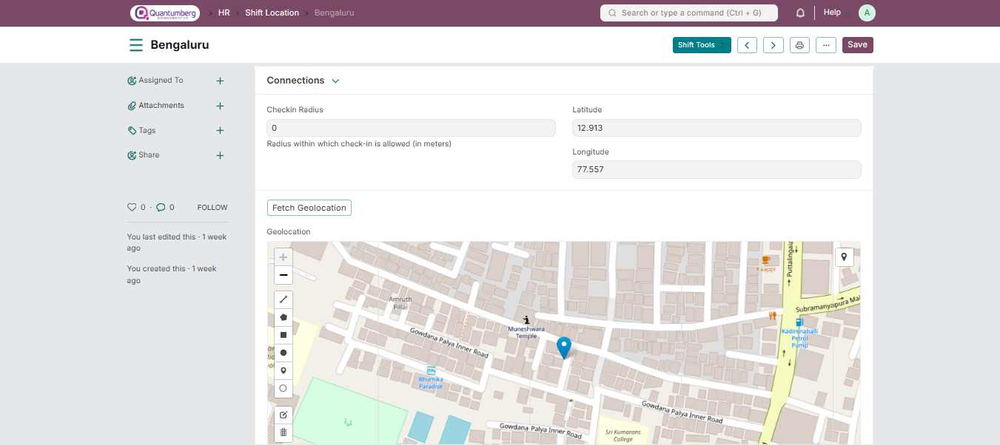

# Shift Location 

Shift Location is used to map locations to Shift Assignments. It can also be used to implement geofencing by ensuring that the employee can only checkin within a certain radius of the location.

# 1. How to create a Shift Location 

To create a new Shift Location, go to: Human Resources > Shift & Attendance > Shift Location

1. Go to the Shift Location list and click on Add Shift Location.

2. Set the Location Name.

3. If you wish to implement geofencing, you will first have to enable **Allow Geolocation Tracking** under HR Settings.

4. You can now set the Checkin Radius, along with the Latitude and Logitude, or click on the Fetch Geolocation button to do so automatically.

5. Save.

# 2. Geofencing

To implement geofencing, you will first have to assign a shift to an employee with the desired Shift Location. While checking in, if the employee is not within the Check-in Radius of the Shift Location, they will be faced with an error that will disallow them from doing so in Q-Dynamics HR.

