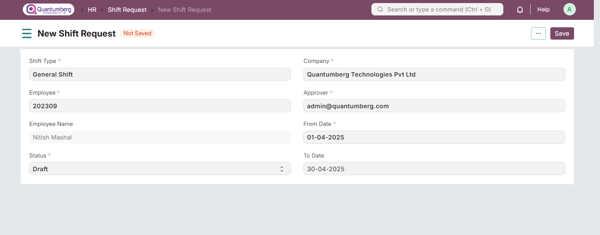
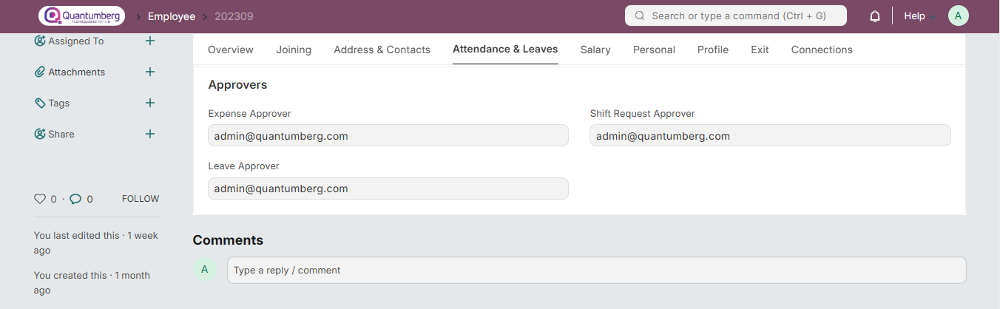

# Shift Request

Shift Request is used by an employee to request for a particular Shift Type in Q-Dynamics HR.

# 1. Prerequisites

To create a Shift Request, these need to be created first:

* [Employee](../Organization%20Management/Employee.md)

* [Shift Type](../ShiftManagement/ShiftType.md)

# 2. How to create a Shift Request

To create a new Shift Request, go to:

    Human Resources > Shift Management > Shift Request

1. Go to the Shift Request List, click on New.

2. Select the Employee and Shift Type.

3. Set the shift duration using From Date and To Date.

4. Select the Approver. If the selected approver does not have access to the Shift Request document, it is shared with the approver with "submit" permission.

5. Click Save.

6. Once the Shift Request is Approved and Submitted, it creates a Shift Assignment automatically.

# 3. Setting Shift Request Approver

A Shift Request Approver is a user who can approve a Shift Request of an employee in Q-Dynamics HR. Approvers can be configured at two levels:

* **Department Level:** Shift Request Approvers for each department can be configured in the Department master.
You can also add multiple approvers for a single department if required.

When an employee belonging to a particular department requests a Shift Type, the Shift Request Approver set in that employee’s Department master will be considered as their Shift Type Approver.

**Employee Level:** Shift Request Approver can also be set directly in the Employee master in Q-Dynamics HR.

If Shift Request Approvers are set at both the employee and department level, then the Employee-level approver will take precedence and will be considered the default Shift Request Approver.

