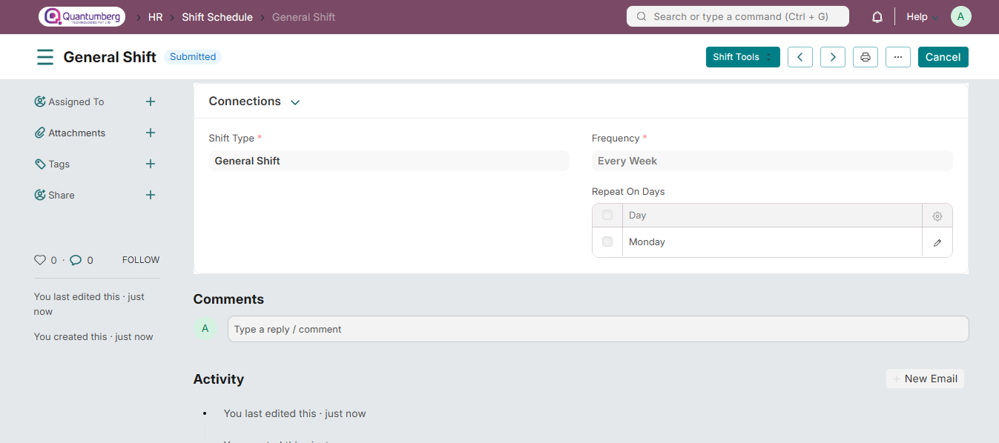

# Shift Schedule

Shift Schedule can be used to create definitions for recurring shift assignments based on selected days and frequency.

# 1. Prerequisites

To create a Shift Schedule, this needs to be created first:

* [Shift Type](../ShiftManagement/ShiftType.md)

# 2. How to create a Shift Schedule

To directly create a Shift Schedule, go to:

    Q-Dynamics HR > HR > Shift & Attendance > Shift Schedule

* Click on Add Shift Schedule.

* Enter the Name.

* Select the Shift Type.

* Select the Frequency.

* Select the Repeat On Days.

* Click on Save, and then Submit.

# 3. Assigning Shift Schedule

To assign a shift schedule to an employee, and to create shift assignments based on it, use Shift Schedule Assignment. You can also assign shift schedules in bulk using the Shift Assignment Tool.

# 4. Related Topics

1. Shift Type

2. Shift Assignment

3. Roster