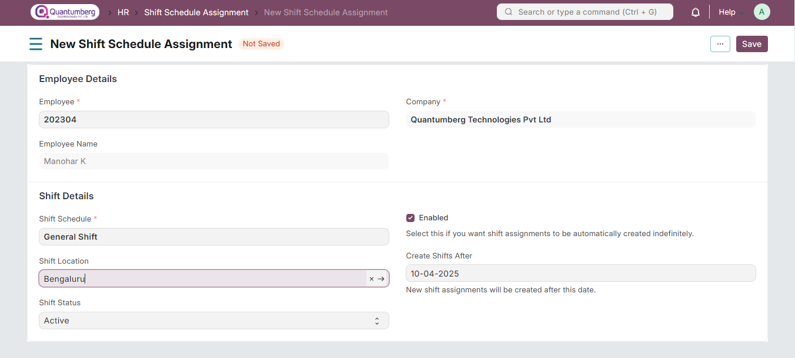

# Shift Schedule Assignment

Shift Schedule Assignment can be used to assign shift schedules to employees and create repeating shift assignments based on it.

# 1. Prerequisites

To create a Shift Schedule Assignment, these need to be created first:

* [Employee](../Organization%20Management/Employee.md)

* [Shift Schedule](../ShiftManagement/ShiftSchedule.md)

* [Shift Location (Optional)](../ShiftManagement/ShiftLocation.md)

# 2. How to create a Shift Schedule Assignment

To directly create a Shift Schedule Assignment, go to:

    Q-Dynamics HR > HR > Shift & Attendance > Shift Schedule Assignment

* Click on Add Shift Schedule Assignment.

* Select the Employee, Shift Schedule, and Shift Location, if any.

* Set the Shift Status. Shift Assignments will be created with this status.

* Select Enabled if you wish for shifts to continue being created automatically via the scheduler. Deselect this if you wish to stop the same.

* Set Create Shifts After. As the name suggests, shifts will be created after this date. This field will be automatically updated after shift assignments are created via the scheduler.

* Click on Save.

# 4. Related Topics

1. Shift Type

2. Shift Assignment

3. Shift Assignment Tool

4. Roster