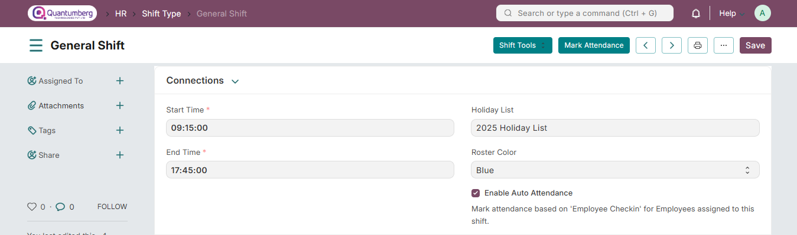
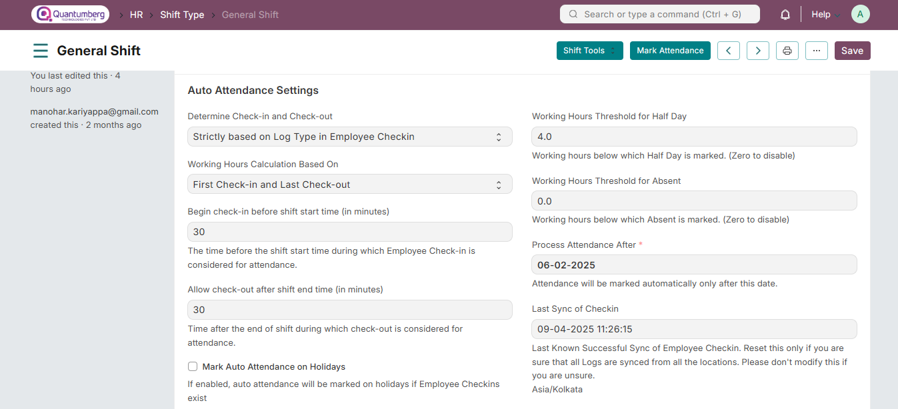

# Shift Type

The Shift Type document allows you to define the different types of shifts in your organization and set up Auto Attendance for those shifts. Auto Attendance marks attendance based on Employee Checkin records for employees assigned to a shift.

To access Shift Type, go to:

    Home > Human Resources > Shift Management > Shift Type

Steps to create a new shift:

1. Click on New

2. Enter the Shift Name, Start Time, and End Time

3. Click Save

In addition to defining the different shifts in your organization, the Shift Type document also includes settings for Auto Attendance. Auto Attendance marks the attendance for employees assigned to this shift based on records in the Employee Checkin document.
Auto Attendance for all Shift Type records is attempted to be marked every hour. You can also manually trigger Auto Attendance for a specific shift type by clicking the Mark Attendance button in the Shift Type document.

# 1. Basic Set Up

1. **Start Time:** The time of day when this shift starts. Enter the time in 24-hour format (e.g., 08:00).

2. **End Time:** The time of day when this shift ends. Enter the time in 24-hour format (e.g., 17:30).

3. **Holiday List:** Select the applicable holidays for this shift. If left blank, the default holiday list from the Employee document or the Company document will be used. Attendance will not be marked by the scheduler on holidays.

4. **Enable Auto Attendance:** Enable this option to allow Q-Dynamics HR to automatically mark attendance for employees assigned to this shift based on their Employee Checkin records.

    **Note: For cases where the 'End Time' is less than 'Start Time', the shift is assumed to be a night shift that starts on one calendar date and ends on the next calendar date.**

# 2. Auto Attendance Settings

You can configure the Auto Attendance feature in Q-Dynamics HR using the following options:

* **Determine Check-in and Check-out:** This setting defines how the system should interpret check-in logs:

    1. **Alternating entries as IN and OUT during the same shift:** The first entry is treated as IN, the next as OUT, followed by IN, and so on. This is useful when the Employee Checkin entries do not include a log type, as many biometric systems do not send specific IN/OUT indicators.

    2. **Strictly based on Log Type in Employee Checkin:** The system uses the log_type field in the Employee Checkin record to identify whether the entry is IN or OUT. Use this option only if your biometric system accurately records the log type.

* **Working Hours Calculation Based On:** You can choose how working hours are calculated for a shift Total time between first check-in and last check-out (including breaks) Sum of all IN/OUT pairs (excluding break times)

    # 1. First Check-in and Last Check-out

    * Use this option when you want to include breaks or consider the total time between the first and last entries.

    * Working hours are calculated as the time difference between the first IN and last OUT Employee Checkin within the shift.

    * If the IN/OUT is determined using alternating entries, the first entry is treated as IN and the last entry as OUT for this calculation.

    # 2. Every Valid Check-in and Check-out

    * Select this option to exclude break times from working hours.

    * Only the time during which the employee is actively checked IN is considered for working hours.

    * The system adds up the durations between each valid IN and OUT pair from the Employee Checkin records.

* **Begin check-in before shift start time (in minutes):** may check in a few minutes early. Use this field to define how many minutes before the shift start time should be considered part of the shift for attendance and working hour calculation.

* **Allow check-out after shift end time (in minutes):** Similarly, to accommodate late check-outs, you can set this value to include them in the shift duration for accurate attendance marking.

* **Mark Auto Attendance on Holidays:** If enabled, Q-Dynamics HR will mark attendance even on holidays, provided Employee Checkins exist for that date. By default, holidays are skipped.

* **Working Hours Threshold for Half Day:** If the total working hours are less than this value, the attendance is marked as Half Day. Set to 0 if you don’t want Half Day marking based on hours.

* **Working Hours Threshold for Absent:** If working hours are less than this value, attendance is marked as Absent. Again, set to 0 to disable automatic absent marking based on working hours.

* **Process Attendance After:** The date from which Auto Attendance will begin. Ensure this is after you’ve started recording Employee Checkin data for the shift.

* **Last Sync of Checkin:** This timestamp tracks up to which point Employee Checkin records have been imported or synced. If logs are auto-synced using a tool, this is updated automatically. For manual entries or custom scripts, you must update this field yourself.

* **Automatically update Last Sync of Checkin:** Enable this for setups using a single biometric device or mobile app check-ins, so the system updates the last synced timestamp automatically—no manual intervention or scripting required.

# 3. Late Entry & Early Exit Settings

* **Enable Late Entry Marking:** Activates marking of Late Entry when the employee checks in after the permissible time.

* **Late Entry Grace Period (in minutes):** Provides a buffer after shift start time. Entries beyond this grace are marked as late.

* **Enable Early Exit Marking:** Activates marking of Early Exit when employees check out before the end of the permissible shift period.

* **Early Exit Grace Period (in minutes):** Defines a buffer before the shift end time. Exits before this grace are marked as early.