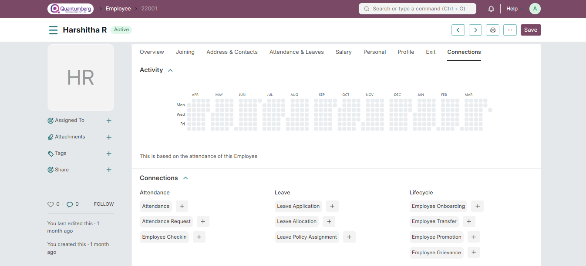

# Q-Dynamics HRMS Documentation

Q-Dynamics HRMS is an open-source, modern, and easy-to-use HR and Payroll software for all organizations. It has everything you need to drive excellence within the company. It is a complete HRMS solution with over 13 different modules, covering everything from Employee Management, Onboarding, and Leaves to Payroll, Taxation, and more!

